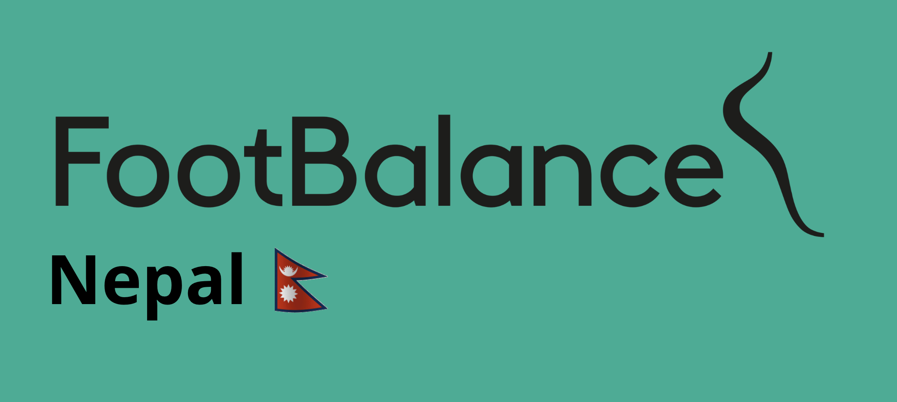
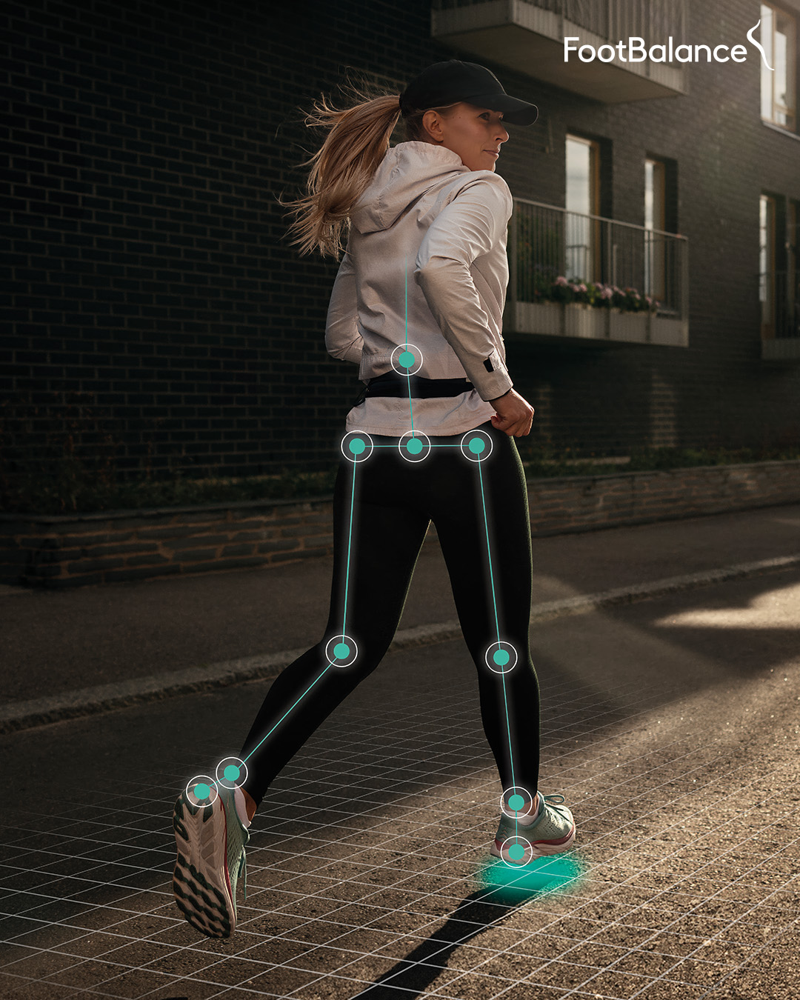

<!-- PROJECT LOGO -->
 

  

  <h3 align="center">FootBalance Nepal</h3>

  

    Custom Insoles & 3D Foot Analysis Website
     
    <a href="https://github.com/Prashanna-Raj-Pandit/FootBalance-Nepal/tree/main/static/files"><strong>Checkout the insoles »</strong></a>
     
     
  

<!-- ABOUT THE PROJECT -->
## About The Project

This is the official website for FootBalance Nepal, a wellness brand offering personalized foot analysis and custom insole solutions. The platform helps users understand and improve their foot health through advanced 3D foot scanning technology, biomechanical analysis, and award-winning Nordic-designed insoles.

Key Features::
* Homepage with a compelling call-to-action for foot health
* About Us section explaining our Nordic roots and mission
* Sheety API integration to store appointment data in Google Sheets
* Product Pages detailing the types of insoles we offer, including medical and kids’ insoles
* FAQs and Contact Form for quick assistance
* Make Appointment form to book personalized foot analysis sessions

### Built With

* [![HTML5][HTML5-logo]][HTML5-url]
* [![CSS3][CSS3-logo]][CSS3-url]
* [![Bootstrap][Bootstrap-logo]][Bootstrap-url]
* [![Flask][Flask-logo]][Flask-url]

[HTML5-logo]: https://img.shields.io/badge/HTML5-E34F26?style=for-the-badge&logo=html5&logoColor=white
[HTML5-url]: https://developer.mozilla.org/en-US/docs/Web/HTML

[CSS3-logo]: https://img.shields.io/badge/CSS3-1572B6?style=for-the-badge&logo=css3&logoColor=white
[CSS3-url]: https://developer.mozilla.org/en-US/docs/Web/CSS

[Bootstrap-logo]: https://img.shields.io/badge/Bootstrap-563D7C?style=for-the-badge&logo=bootstrap&logoColor=white
[Bootstrap-url]: https://getbootstrap.com

[Flask-logo]: https://img.shields.io/badge/Flask-000000?style=for-the-badge&logo=flask&logoColor=white
[Flask-url]: https://flask.palletsprojects.com/

<!-- CONTRIBUTING -->
## Contributing

If you have a suggestion that would make this better, please fork the repo and create a pull request. You can also simply open an issue with the tag "enhancement".
Don't forget to give the project a star! Thanks again!

1. Fork the Project
2. Create your Feature Branch (`git checkout -b feature/AmazingFeature`)
3. Commit your Changes (`git commit -m 'Add some AmazingFeature'`)
4. Push to the Branch (`git push origin feature/AmazingFeature`)
5. Open a Pull Request

<!-- LICENSE -->
## License

Distributed under the Unlicense License. See `LICENSE.txt` for more information.

(<a href="#readme-top">back to top</a>)

# Footbalance-Nepal

Check this website live at https://footbalancenepal.onrender.com/#home and https://footbalance-nepal.vercel.app/

## The landing page

